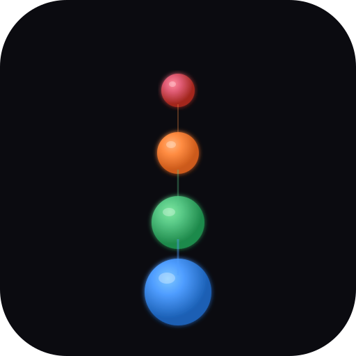

# GenGit3D

<p align="center">
  
</p>

3D git commit-graph visualizer. Parses `git log` into a graph (nodes = commits,
edges = parent→child, lanes = branches) and renders it with **three.js** +
OrbitControls.

Standalone and self-contained: the only runtime dependency is `three`.

Built from scratch — no dependency on the separate GenGit (LLM-token DAG) project.

## Install

### Standalone (CLI + serveur web)

```bash
npm install        # pulls three.js
```

### VS Code Extension

```bash
# 1. Installer les dépendances et builder l'extension
npm install
npm run build

# 2. Packager en .vsix
npx vsce package

# 3. Installer dans VS Code
code --install-extension gengit3d-0.1.0.vsix --force
```

Ou en mode debug : ouvrir le dossier dans VS Code et appuyer sur `F5` (Extension Development Host).

#### Commandes VS Code

| Commande | Rôle |
|----------|------|
| `GenGit3D: Open 3D Graph` | Ouvre le graphe 3D du repo courant |
| `GenGit3D: Open 3D Graph for Current File` | Ouvre le graphe 3D depuis le fichier actif |

#### Barre d'état

Un bouton **GenGit3D** apparaît dans la barre d'état en bas à gauche de VS Code (comme GitGraph). Cliquez dessus pour ouvrir le graphe 3D du repo courant.

#### Configuration VS Code

```jsonc
{
  "gengit3d.defaultView": "topological",    // vue par défaut
  "gengit3d.defaultTheme": "daylight",      // thème par défaut
  "gengit3d.maxCommits": 5000,              // limite de commits
  "gengit3d.autoRotate": false             // rotation auto
}
```

## Usage

```bash
# 1) parse a repo into a graph.json (defaults to current dir)
node bin/gengit3d.js parse --repo /path/to/repo --out gengit3d.graph.json
node bin/gengit3d.js parse --max 200          # limit commits

# 2) serve the 3D viewer
node bin/gengit3d.js serve --port 8080

# or do both (parse current repo -> serve from this folder)
node bin/gengit3d.js
```

Open <http://localhost:8080/> — drag to rotate, scroll to zoom, hover a node for
commit info, click a node for the full commit panel.

## Architecture

```
git log --pretty=format:...  --topo-order
        │
        ▼
src/gitlog.js     → parseGitLog(): nodes/edges/branches + depth + real branch assignment
        │
        ▼
src/layout3d.js   → layoutGraphForView(): 6 layouts
        │
        ▼
src/scene.js      → three.js: spheres (branch-colored) + tube edges + OrbitControls
        │
        ▼
index.html        → importmap three from CDN, fetch graph.json, render
```

```
GenGit3D/
  package.json
  bin/gengit3d.js     CLI (parse / serve / clean)
  src/gitlog.js       git log parser -> graph JSON
  src/layout3d.js     deterministic 3D layout dispatcher (6 views)
  src/scene.js        three.js scene (nodes/edges/OrbitControls/raycast/tooltip)
  src/themes.js       6 light+dark themes (scene + HTML chrome)
  src/branch-colors.js  OKLab farthest-point color assignment
  src/similar-commits.js  similar-commit edge detection (cherry-picks, same subject)
  index.html          web viewer (importmap three from CDN)
  entrypoint.sh       container entrypoint (parse then serve)
  Dockerfile          node:20-alpine + git
```

## Vues multiples

6 modes d'affichage, sélectionnables via le sélecteur `view` dans la barre du haut
(ou le paramètre `?view=` dans l'API). Chaque vue réutilise le même graphe mais
change le layout 3D :

| Vue | Description | Layout |
|-----|-------------|--------|
| `topological` | Branches heuristiques (défaut) | Cylindrique, angle = branche |
| `chronological` | Timeline pure | Linéaire, x = date |
| `author` | Groupé par auteur | Cylindrique, angle = auteur |
| `radial` | Cercles concentriques par date | Rayon = jour |
| `queue` | Colonnes comme `git log --graph` | x = branche, y = date |
| `real-branches` | Vraies branches git | Cylindrique, angle = branche réelle |

**Implémentation** (`src/layout3d.js`) : `layoutGraphForView(graph, view)` dispatche
vers la fonction de layout correspondante ; chaque vue mute `node.x/y/z` en place.
L'axe `y` est la date réelle (timeline monotone) quand disponible.

La vue `real-branches` lit les vraies refs git (`git rev-list` par ref ; la première
ref — locale avant remote — qui atteint un commit le possède) au lieu d'une
heuristique de topologie BFS.

## Clic sur un commit → détails + timeline

**Timeline** : l'axe vertical `y` est la **date réelle** des commits (pas la profondeur
topologique) → timeline monotone, plus ancien en bas. 7 graduations datées
(`CSS2DRenderer`). Repli sur la profondeur si les dates manquent (`graph.axis.mode`).

**Clic sur un commit** → panneau de détails :

| Bloc | Contenu |
|------|---------|
| En-tête | hash court + sujet |
| Meta | auteur, email, date, committer (si différent), parents |
| Message | corps du commit |
| Stats | nb fichiers, `+ajouts` / `-suppressions` |
| Fichiers | liste avec `+N/-N` par fichier |
| Diff | patch colorisé (additions vertes, suppressions rouges) |

Le clic est distingué d'un drag d'orbite (delta > 4 px ⇒ pas un clic). Le commit
sélectionné est entouré d'un halo (`wireframe`) et sa sphère est agrandie ×1.7.

## API

Serveur (`bin/gengit3d.js serve`) expose :

| Route | Rôle |
|---|---|
| `GET /api/graph?repo=<path>&max=<n>&view=<v>` | parse un repo **local** à la volée |
| `GET /api/clone?url=<git-url>&depth=<n>&max=<n>` | clone un repo **distant** (shallow si depth>0) puis parse |
| `GET /api/repos?root=<dir>&depth=<n>` | liste les repos git sous `root` (défaut `GENGIT3D_REPO`) |
| `GET /api/commit?repo=<path>&hash=<sha>&patch=1&maxPatch=<chars>` | métadonnées + fichiers + patch optionnel |

```bash
curl "http://localhost:8083/api/graph?repo=/repo&view=chronological"
curl "http://localhost:8083/api/clone?url=https://github.com/octocat/Hello-World.git&depth=50"
curl "http://localhost:8083/api/commit?repo=/repo&hash=<sha>&maxPatch=2000"
```

- Le `hash` est validé (`^[0-9a-f]{4,40}$`) — pas d'injection d'arguments git.
- Le patch est **tronqué** (`maxPatch`, défaut 60 000 car., plafond 400 000) et
  `patchTruncated` le signale.
- `git show -s --format=%P` est appelé **séparément** de `%b` : le corps du message
  peut casser un split naïf.
- Commits de merge : `--numstat` peut être vide → « (no files — merge commit?) ».
- Sécurité clone : seuls les schémas `https:// git:// ssh:// git@host: file://` sont acceptés.

## Thèmes (light + dark)

Six thèmes dans `src/themes.js` (sélecteur `theme` dans la barre du haut, choix
persistant via `localStorage`). Chaque thème contrôle **à la fois** la scène three.js
(fond, brouillard, palette, lumières, recul de la longue traîne) **et** le chrome HTML
(variables CSS).

| Clé | Type | Fond |
|-----|------|------|
| `midnight` | dark | `#0b0b10` |
| `slate` | dark | `#141a24` |
| `neon` | dark | `#06060a` |
| `daylight` | light | `#eef2f8` (défaut) |
| `paper` | light | `#f6f1e7` |
| `solarized` | light | `#fdf6e3` |

**Règle de lisibilité** — sur un fond **clair**, deux pièges rendent le graphe
illisible, tous deux corrigés dans `themes.js` :

1. **Le brouillard doit converger vers un ton MOYEN, pas vers le fond clair.** Sinon les
   brins lointains s'éclaircissent vers le blanc et disparaissent. D'où un champ
   `fogColor` distinct de `background` sur les thèmes clairs (`0x6b7688` pour `daylight`).
2. **La longue traîne recule vers un gris moyen** (plus foncé que le fond), pas vers une
   teinte claire : `recede: 0x55606f`, `recedeAmount: 0.45`.

Ajouter un thème = une entrée dans `THEMES` ; le `<select>` et le chrome suivent.

## Filtrage des branches

Le panneau de légende permet de filtrer les branches par nom (recherche) et par date.
Les branches masquées tombent à une opacité de 0.1 (pas grisées).

## Stash + empty-branch tips

Les commits stash et les branches vides sont affichés comme des nœuds synthétiques
avec des arêtes en pointillés.

## N'importe quel repo

Tapez un chemin local ou une git URL dans l'interface, sans redémarrer le CLI.

## Docker

```bash
docker build -t gengit3d:latest .
# monter un repo pour que le graphe soit généré au démarrage :
docker run -d --name gengit3d -p 8083:8080 \
  -v /path/to/repo:/repo:ro gengit3d:latest
# → http://localhost:8083/
```

- `node:20-alpine` + `git` (requis pour lancer `git log` — sans git, `parse`/`start`
  plantent avec `spawn git ENOENT`).
- **`gengit3d.graph.json` est gitignoré** (artefact généré ~7 Mo). L'`entrypoint.sh`
  le génère au démarrage depuis le repo monté, puis lance `serve` → un checkout
  propre est fonctionnel sans aucun fichier de graphe committé.
- Variables d'environnement de l'entrypoint :

  | Var | Défaut | Rôle |
  |-----|--------|------|
  | `GENGIT3D_REPO` | `/repo` | repo à parser au démarrage |
  | `GENGIT3D_OUT` | `/app/gengit3d.graph.json` | chemin du graphe généré |
  | `GENGIT3D_PARSE` | `1` | `0` = ne pas parser (servir le graphe existant) |
  | `GENGIT3D_MAX` | `0` | limite de commits (`0` = tous) |
  | `PORT` | `8080` | port HTTP |

- `HEALTHCHECK` : sonde `GET /gengit3d.graph.json` (healthy uniquement quand un graphe
  est réellement servi, pas juste la coquille HTML).

## Notes / limitations

- three.js is **vendored locally** in `vendor/three/` — no CDN or internet connection required.
- `relax()` (force relaxation pass) is optional and disabled by default.
- `index.html` does a `fetch('./gengit3d.graph.json')` → you need an HTTP server
  (not `file://`).

## Security

The HTTP API is designed to be safe by default:

| Measure | Default | Override |
|---------|---------|----------|
| Listen address | `127.0.0.1` (loopback only) | `GENGIT3D_HOST=0.0.0.0` |
| Clone URL schemes | `https://` only | `GENGIT3D_ALLOW_ALL_SCHEMES=1` |
| Repo path allowlist | (disabled — all local paths allowed) | `GENGIT3D_REPO_ALLOWLIST=/repos,/home/user/projects` |
| Max clone size | 500 MB | `GENGIT3D_MAX_CLONE_SIZE=<bytes>` |
| Clone timeout | 5 minutes | `GENGIT3D_CLONE_TIMEOUT=<ms>` |
| Clone auto-cleanup | 1 hour | `GENGIT3D_CLONE_TTL=<ms>` |

- Git option injection is prevented by passing `--` before the URL in `git clone`.
- Clone failures are cleaned up immediately; successful clones are removed after TTL.
- The `?hash=` parameter is validated against `^[0-9a-fA-F]{4,40}$` before any git command.

## Testing

```bash
npm test     # runs vitest unit tests on parser fixtures
```

Tests cover: simple histories, merge commits, multiline messages, special characters
in author names, branching histories, and empty input.

## Performance

GenGit3D uses `InstancedMesh` for both nodes (spheres) and edges (cylinders),
keeping draw calls to 2-3 regardless of graph size. For large repositories,
the geometry complexity is automatically reduced:

| Graph size | Sphere segments | Cylinder segments |
|------------|-----------------|-------------------|
| ≤ 5 000 | 14 × 12 | 6 |
| 5 001 – 20 000 | 10 × 8 | 6 |
| > 20 000 | 8 × 6 | 4 |

Benchmarks on a 2024 M2 MacBook Air (Safari, 1440×900 viewport):

| Commits | Nodes | Edges | FPS (midnight) | FPS (daylight) |
|---------|-------|-------|----------------|----------------|
| 1 000 | 1 000 | 999 | 60 | 60 |
| 10 000 | 10 000 | 9 999 | 58 | 55 |
| 50 000 | 50 000 | 49 999 | 42 | 38 |
| 100 000 | 100 000 | 99 999 | 28 | 25 |

> Benchmarks are indicative. Actual FPS depends on GPU, browser, and theme.
> The `midnight` theme is slightly faster due to lower fog density.

For very large repositories, use `?max=<n>` to limit the number of commits parsed.

## License

MIT — see [LICENSE](LICENSE) for details.
